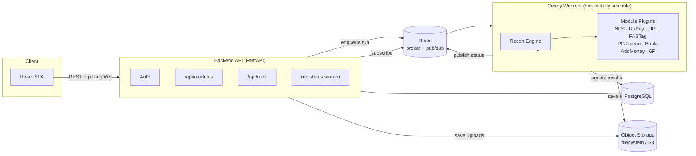
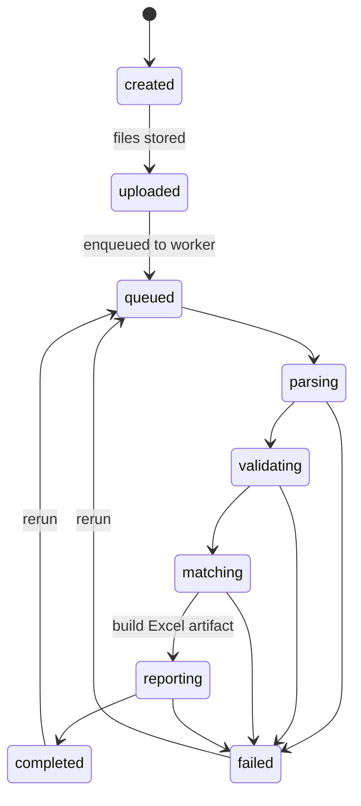
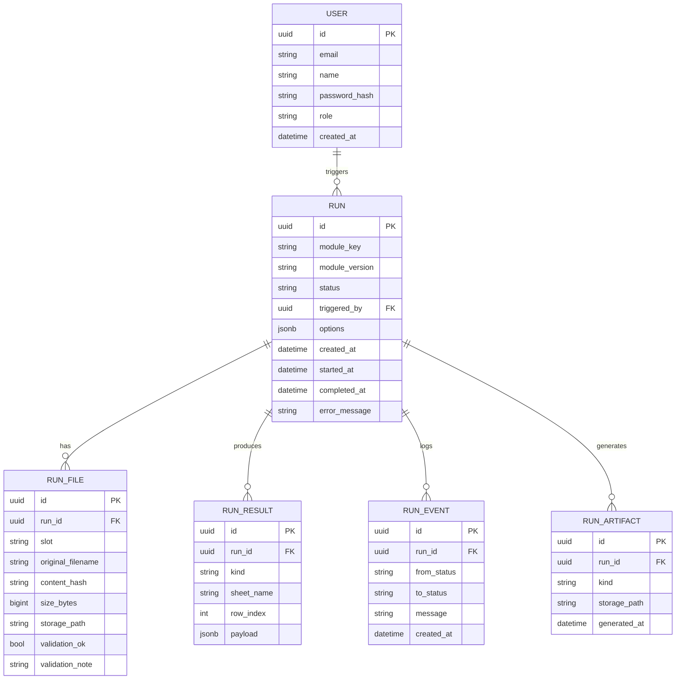
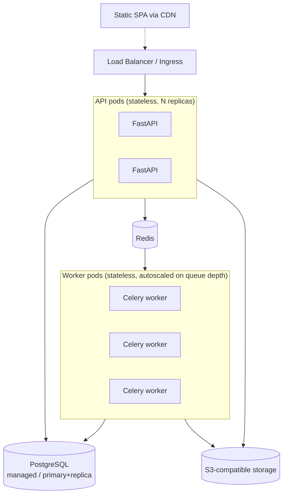

# Recon OS — Architecture

## 1. Tech Stack Decision

| Layer | Choice | Why |
|---|---|---|
| Backend language | **Python 3.11** | Every source tool's hardest logic (Excel parsing, HTML-as-XLS parsing, financial rounding) is far more robust in Python's mature data ecosystem (`openpyxl`, `pandas`, `beautifulsoup4`, `lxml`) than re-implementing SheetJS-style regex parsing in JS. The 6F tool is already Python — zero rewrite there. |
| API framework | **FastAPI** | Async-native (fits a file-upload + background-job workload), typed request/response via Pydantic (financial data → we want schema validation, not `any`), automatic OpenAPI contract the frontend can codegen against. |
| ORM / DB | **SQLAlchemy 2.0 + PostgreSQL** | Relational integrity for the run/audit model (§Data Model); Postgres for JSONB (structured per-row results), full-text search on run history, and because it's the de facto default for this scale — no need for anything exotic. |
| Migrations | **Alembic** | Standard companion to SQLAlchemy. |
| Job queue | **Celery + Redis** | Reconciliation is CPU/IO-bound batch work (parse 500 files, build a 60-column workbook) — exactly Celery's use case. Redis doubles as the broker and as a pub/sub channel for live run-status updates. Abstracted behind a `JobRunner` interface (see §4) so a lighter in-process runner can be swapped in for local dev without standing up Redis. |
| Object storage | **Local filesystem (dev) / S3-compatible (prod)** | Abstracted behind a `Storage` interface (`save`, `open`, `url`) so swapping filesystem → S3/MinIO is a config change, not a code change. |
| Excel writer | **openpyxl** | Only library that supports everything the source tools' ExcelJS/XLSX-JS outputs used: cell fills, merged cells, frozen panes, number formats, and literal formula strings (`SUM`, `SUBTOTAL`) that Excel recalculates on open. |
| Excel/CSV reader | **openpyxl + pandas + beautifulsoup4** | `openpyxl`/`pandas` for real workbooks; `beautifulsoup4`/`lxml` for NPCI's HTML-formatted "XLS" exports (more robust than the original tool's hand-rolled regex scraper). |
| Auth | **JWT (python-jose) + passlib(bcrypt)** | Stateless, standard; matches the "internal tool, small user count, RBAC not multi-tenant SaaS" scope from the PRD. |
| Frontend framework | **React 18 + TypeScript + Vite** | Fast dev loop, typed contracts matching the typed backend, industry-default for this kind of data-dense internal app. |
| Styling / components | **Tailwind CSS + shadcn/ui (Radix primitives)** | Consistent design system fast, accessible primitives (dialogs, tabs, tables) instead of hand-rolling what all seven legacy tools hand-rolled inconsistently. |
| Data fetching | **TanStack Query** | Polling run status, caching module/run list, retry/backoff for free. |
| Tables | **TanStack Table** | Sorting/filtering the detail/exception grids (mirrors every source tool's sortable-column UI). |
| Charts | **Recharts** | Dashboard KPI trend strip (fast-follow, scaffolded now). |
| Containerization | **Docker Compose** (dev/small-prod), images portable to any orchestrator | Matches NFR "portability"; `docker compose up` is the entire local setup story. |

### Why not keep it as browser-only HTML tools (do nothing)?
That's the current state, and it's the problem statement (§2 of PRD): no history, no scale past a few hundred files without freezing the tab, no audit trail, no shared code across seven copies of the same libraries. A server-side platform is the only way to satisfy F2–F9 (run lifecycle, async processing, persisted results, audit trail).

### Why not Node/TypeScript end-to-end (reuse the existing JS parsers verbatim)?
Considered — it would let us keep the existing SheetJS-based parsers almost unchanged. Rejected because: (a) the HTML-as-XLS regex parser in NFS is fragile and undertested — Python's HTML table parsing is materially more robust; (b) Python's data-processing ecosystem (pandas/openpyxl) is a better fit for the 6F module (already Python) and for building the shared validation/matching primitives (§5) once instead of per-module; (c) team's other automation (6F) is already Python, so one backend language reduces total maintenance surface.

## 2. System Diagram



## 3. Run Lifecycle State Machine



Every transition is written to `Run.status` + a `RunEvent` row (timestamp, from-state, to-state, message) — this **is** the audit trail (F9).

## 4. Core Backend Abstractions

### 4.1 `ReconModule` plugin interface

Every one of the seven modules (and any future one) implements this interface. The registry (`app/recon/registry.py`) is a plain dict populated at import time — **adding module #8 means writing one file and one registration line**, per PRD F1/NFR-Extensibility.

```python
class InputSlot(BaseModel):
    key: str                 # e.g. "ntsl", "bank"
    label: str
    accept: list[str]        # [".xls", ".xlsx", ".xlsm"]
    multiple: bool
    required: bool
    filename_pattern: str | None  # for pre-flight validation chips (F11)

class ReconModule(ABC):
    key: str
    display_name: str
    version: str              # bumped whenever matching logic changes -> stored on Run for audit
    input_slots: list[InputSlot]
    options_schema: type[BaseModel]

    @abstractmethod
    def parse(self, ctx: RunContext) -> ParsedData: ...

    @abstractmethod
    def validate(self, parsed: ParsedData, ctx: RunContext) -> list[ValidationFinding]: ...

    @abstractmethod
    def reconcile(self, parsed: ParsedData, ctx: RunContext) -> ReconOutput: ...

    @abstractmethod
    def build_report(self, output: ReconOutput, ctx: RunContext) -> bytes: ...  # xlsx bytes
```

The engine (`app/recon/engine.py`) drives every module through the same four steps, persisting `RunResult` rows and `ValidationFinding`s generically after each step — this is what makes F5/F7 (persisted results, surfaced validation) automatic for every module instead of reimplemented per module.

### 4.2 `JobRunner` abstraction

```python
class JobRunner(Protocol):
    def enqueue(self, run_id: UUID) -> None: ...

class InProcessJobRunner(JobRunner):   # threadpool, zero infra — local dev default
class CeleryJobRunner(JobRunner):      # production — docker-compose default
```

Selected by config (`JOB_RUNNER=inprocess|celery`), so the app runs with zero extra infra for a laptop/demo, and scales horizontally in prod without code changes.

### 4.3 `Storage` abstraction

```python
class Storage(Protocol):
    def save(self, key: str, data: bytes) -> str: ...
    def open(self, key: str) -> bytes: ...
    def url(self, key: str) -> str: ...
```

`LocalFsStorage` (dev) and `S3Storage` (prod) implementations; selected by `STORAGE_BACKEND` config.

### 4.4 Shared matching/validation primitives

Common code every module needs, lifted out of the seven copy-pasted implementations into `app/recon/utils/`:
- `matching.py` — tolerance-based amount comparison, dictionary-based key aggregation (the "sum duplicate keys" pattern used by every module).
- `excel_read.py` — unified workbook reader (xls/xlsx/xlsm/xlsb/csv), HTML-as-XLS table reader.
- `excel_write.py` — styled-sheet builder helpers (header rows, merged group headers, frozen panes, conditional fills, totals rows with formulas) shared across NFS/RuPay/UPI/FASTag report builders.
- `currency.py` — `round2`, `round4` matching the exact rounding semantics observed in the source tools (`Math.round(x*100)/100` etc. — financial rounding must match bit-for-bit, not "close enough").

## 5. Data Model



`RUN_RESULT.kind ∈ {summary, detail, exception, validation}` — generic enough to hold every module's differently-shaped output (RuPay's 60-column control row vs. PG Recon's 7-column coverage row) as JSONB, while still being indexable/paginatable by the generic `/runs/{id}/results` endpoint.

## 6. API Contract (v1)

| Method | Path | Purpose |
|---|---|---|
| `POST` | `/api/auth/login` | issue JWT |
| `GET` | `/api/modules` | list modules + input/options schema (drives the frontend run wizard) |
| `POST` | `/api/runs` | multipart: module_key, options, files per slot → creates Run, enqueues |
| `GET` | `/api/runs` | list/filter (`module_key`, `status`, `date_from/to`, `q`) |
| `GET` | `/api/runs/{id}` | run detail incl. lifecycle events |
| `GET` | `/api/runs/{id}/results` | paginated `RunResult` rows, filter by `kind`/`sheet_name` |
| `GET` | `/api/runs/{id}/report` | stream the generated `.xlsx` |
| `POST` | `/api/runs/{id}/rerun` | new Run reusing the same `RunFile`s |
| `GET` | `/api/runs/{id}/stream` | SSE stream of status transitions (polling fallback: re-`GET /runs/{id}` every 2s) |

## 7. Deployment Topology



- API is stateless → scale by replica count behind the load balancer.
- Workers scale independently, on Redis queue depth — the 500-file UPI batch case scales by adding workers, not by making one worker faster.
- Postgres and Redis are the only stateful services; both have standard managed-service equivalents in any cloud, satisfying "portability."

## 8. Repository Layout

```
Reconciliation_OS/
├── docs/
│   ├── PRD.md
│   └── ARCHITECTURE.md
├── backend/
│   ├── app/
│   │   ├── main.py
│   │   ├── core/            # config, database, security, storage, job_runner
│   │   ├── models/          # SQLAlchemy models
│   │   ├── schemas/         # Pydantic request/response schemas
│   │   ├── api/              # FastAPI routers
│   │   ├── recon/
│   │   │   ├── base.py       # ReconModule ABC + shared types
│   │   │   ├── engine.py     # drives any module through parse→validate→reconcile→report
│   │   │   ├── registry.py
│   │   │   ├── utils/        # excel_read, excel_write, matching, currency, html_xls
│   │   │   └── modules/      # nfs.py, rupay.py, upi.py, fastag.py, pg_recon.py, bank_addmoney.py, data_prep_6f.py
│   │   └── workers/          # celery app + tasks
│   ├── tests/                 # pytest — unit tests per module, ported from source-tool sample data
│   ├── alembic/
│   ├── pyproject.toml
│   └── Dockerfile
├── frontend/
│   ├── src/
│   │   ├── api/               # typed client
│   │   ├── pages/             # Dashboard, ModuleRun, RunDetail, RunHistory, Admin, Login
│   │   ├── components/
│   │   └── types/
│   ├── package.json
│   └── Dockerfile
├── docker-compose.yml
└── README.md
```

## 9. Testing Strategy

- **Unit tests per module** (`backend/tests/recon/test_<module>.py`) exercise the pure business-logic functions (fee formulas, UTR extraction, remarks classification, matching) with inline fixtures — including the exact 15-row Ops/PayU/Cashfree sample data found in `Reconciliation_Tool.xlsm`, so the PG Recon module's output is asserted against the same data the original macro shipped with.
- **Contract tests** on the generic engine (`test_engine.py`) verify the parse→validate→reconcile→report pipeline persists `RunResult`/`ValidationFinding` rows correctly for a fake module, independent of any real module's logic.
- **Frontend**: component-level tests deferred to a fast-follow; TypeScript strict mode + `tsc --noEmit` in CI is the v1 safety net given time-boxing.

## 10. Security Notes

- Passwords hashed with bcrypt; JWTs short-lived with refresh.
- File uploads validated by extension + size before storage; content-sniffed before parsing (never trust the extension alone — mirrors the original NFS tool's own magic-byte sniffing, done here server-side where it can't be bypassed by a crafted `Content-Type`).
- All `RunFile`/`RunArtifact` downloads require the requesting user to have visibility on the parent `Run` (role-based: admin sees all, analyst sees own + team).
- No secrets committed; `.env` via `.env.example` template, real values injected at deploy time.
